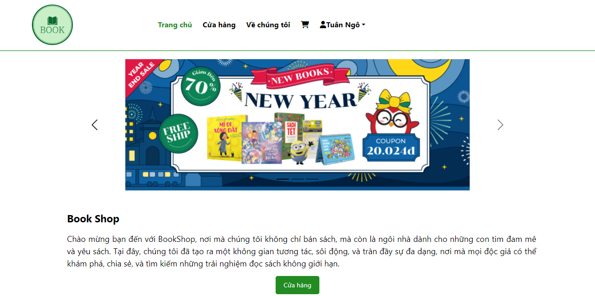

# book-shop-online

## Mô tả dự án
Dự án Book Shop là một hệ thống quản lý cửa hàng sách mua bán trực tuyến, giúp người dùng khám phá, tìm kiếm và mua sách một cách thuận lợi. Hệ thống này cung cấp cho quản trị viên các công cụ để quản lý kho sách, đơn hàng và thống kê doanh thu.

Hệ thống được xây dựng bởi các thành viên:
* Đào Văn Thành - 21020094
* Ngô Văn Tuân - 21020031
* Phùng Quang Tiến - 21020090
* Trần Quang Tài - 21020028
* Đào Duy Chiến - 21020005
* Lê Hải Đăng - 21020065

## Tính năng chính

### Người dùng

#### Quản lý tài khoản
* Đăng ký tài khoản
* Đăng nhập / Đăng xuất
* Xem / chỉnh sửa thông tin các nhân
* Đổi mật khẩu

#### Xem thông tin sách
* Xem sách theo best seller
* Xem danh sách tất cả các sách
* Lọc sách theo thể loại, khoảng giá
* Tìm kiếm sách
* Xem thông tin sách

#### Quản lý giỏ hàng
* Thêm sản phẩm vào giỏ hàng 
* Xem giỏ hàng
* Xóa sản phẩm khỏi giỏ hàng
* Thanh toán sản phẩm

#### Quản lý đơn hàng
* Tạo đơn hàng
* Xem tình trạng đơn hàng
* Xem sản phẩm đã mua
* Hủy đơn hàng

### Admin

#### Quản lý tài khoản
* Đăng nhập
* Đăng xuất

#### Quản lý thông tin sách
* Thêm sách
* Sửa thông tin sách
* Tìm kiếm sách
* Thống kê doanh thu, số sách đã bán

#### Quản lý đơn hàng
* Xem danh sách các đơn hàng
* Câp nhận trạng thái đơn hàng

## Công nghệ sử dụng

### Frontend (FE)
* Ngôn ngữ lập trình: Javascript (JS)
* Framework: ReactJS
* Giao diện người dùng (UI): Bootstrap

### Backend (BE)
* Ngôn ngữ lập trình: Java
* Framework: Spring Boot

### Cơ sở dữ liệu (database)
* Hệ quản trị cơ sở dữ liêu (DBMS): MySQL